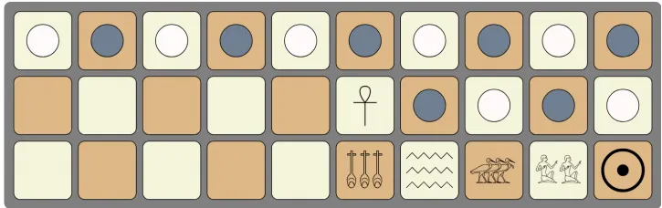

<div align="center">

<h1>Senet</h1>

<p><strong>The oldest board game known to survive to the present day, playable
against an AI opponent that reasons about dice under uncertainty — with a
graphical board, a live colour-coded console, and full save/load.</strong></p>

<p>
  
  
  
  
  
</p>



</div>

---

## Table of contents

- [Overview](#overview)
- [Features](#features)
- [Quick start](#quick-start)
- [The interface](#the-interface)
- [Playing a game](#playing-a-game)
- [Difficulty and search depth](#difficulty-and-search-depth)
- [Saving and loading](#saving-and-loading)
- [Project structure](#project-structure)
- [The rules, in brief](#the-rules-in-brief)
- [The AI, in brief](#the-ai-in-brief)
- [Building without the scripts](#building-without-the-scripts)
- [Documentation](#documentation)
- [Contributing](#contributing)
- [License](#license)

## Overview

Senet is a race game played on a board of thirty houses arranged in an
S-shaped path, first attested in Egyptian tomb art from roughly 2600 BCE and
played for millennia before disappearing under Roman rule. Its original
rules were never written down; this project implements the widely used
reconstruction known as **Kendall's Rules**, including its five special
houses and the "one chance to leave" rule that governs the final stretch of
the board.

The project is a self-contained, dependency-free Java **Swing desktop
application**: a human plays against a computer opponent on a graphical,
click-to-move board, with a live console panel reporting every roll, move,
capture, and special-house effect as it happens — clearly attributed to the
human or the computer. The computer chooses its moves with
**Expectiminimax**, a search algorithm built for exactly this kind of game —
adversarial, but with a genuine element of chance (the throwing-stick roll)
between every pair of turns.

## Features

- **A graphical, click-to-move board** — the 30 houses are drawn in their
  authentic S-shaped path, colour-coded by house type, with pieces you move
  by clicking them directly; movable pieces are highlighted for you.
- **A live, colour-coded console panel** — every dice roll, move, capture,
  and special-house effect is timestamped and printed as it happens, tagged
  and coloured by who caused it (the player in blue, the computer in
  orange, system/rules narration in grey). Hypothetical moves the AI merely
  considers during search are never shown, so the console only ever
  reports what really happened.
- **Full Kendall's Rules implementation** — legal-move checking, captures by
  position swap, the House of Happiness checkpoint, and the special exit
  rules of Houses 27 through 30.
- **Expectiminimax computer opponent** — a true chance-aware search, not a
  simple heuristic bot; see [`docs/AI_DESIGN.md`](docs/AI_DESIGN.md). It
  runs on a background thread, so the interface never freezes while the
  computer thinks.
- **Five difficulty presets, plus a custom search depth** — from a fast,
  beatable Easy setting to a deep, deliberate Expert setting, or any depth
  you choose yourself, all set from a setup dialog before a new game.
- **Pause and resume** — a Pause button freezes input at any point during
  your turn without losing the game; press Resume to pick up exactly where
  you left off.
- **Save and load** — persist a game to a named slot on disk at any point
  during your turn, and reload it in a later session from the Game menu.
- **A rules reference built in** — a Help menu item opens the full rules in
  a dialog, for anyone new to Senet.
- **Zero external dependencies** — the entire project builds with nothing
  but the standard Java library (Swing included).

## Quick start

### Requirements

- A JDK, version 17 or newer (only the standard library is used — no
  external dependencies, and a graphical desktop environment to display the
  Swing window).

### Run it

**macOS / Linux**

```bash
./run.sh
```

**Windows**

```bat
run.bat
```

Both scripts compile every file under `src/` into `bin/` and then launch the
game window. You can also open the `src/` folder directly in any IDE that
understands a plain source tree (IntelliJ IDEA, Eclipse, VS Code with the
Java extension) and run `senet.Senet`.

## The interface

The window is split into three parts:

- **Board (left)** — the 30 houses, drawn in the classic S-shaped path.
  Special houses are tinted (green for Rebirth, gold for Happiness, blue
  for Water, and so on) and labelled with their letter. Pieces are drawn as
  filled circles in each player's colour with their id inside; when it is
  your turn and you have rolled, every piece you may legally move is
  outlined in gold — click one directly on the board to move it.
- **Console (right)** — a scrolling, timestamped log of everything that has
  happened: `PLAYER` lines in blue, `COMPUTER` lines in orange, and neutral
  `GAME`/`SYSTEM` lines in grey for capture and special-house detail,
  warnings, and the eventual `RESULT` line announcing the winner.
- **Controls (far right)** — the current turn, the last roll, both
  players' piece counts, the active difficulty and search depth, and the
  action buttons: Roll Dice, Pause/Resume, Save Game, Load Game, New Game,
  and Rules. A `Game` menu at the top duplicates New/Save/Load/Exit, and a
  `Help` menu opens the same rules dialog as the Rules button.

## Playing a game

Choose **Game > New Game...** (or the **New Game** button) to open the setup
dialog: enter your name, choose a difficulty (or `CUSTOM` for a specific
search depth), and optionally enable verbose AI search logging, which is
printed to the terminal rather than the on-screen console since it is very
detailed diagnostic output.

On your turn:

1. Click **Roll Dice**. The console reports your roll, and every piece you
   may legally move with it is outlined in gold on the board.
2. Click one of the highlighted pieces to move it. The console reports the
   move and any capture or special-house effect that follows.
3. If you have no legal move for your roll, the turn is skipped
   automatically and the console explains why.

The computer's turn runs automatically: it rolls, thinks (shown in the
console and in the turn status), and then moves — all without freezing the
window, since the search runs on a background thread.

Click **Pause** at any point during your turn to freeze input without
losing your position; click **Resume** to continue. Use **Save Game** to
write the current position to a named slot at any time, and **Load Game**
from the main menu to pick it back up in a later session.

## Difficulty and search depth

| Difficulty | Default search depth |
|------------|-----------------------|
| Easy       | 2 |
| Medium     | 4 |
| Hard       | 6 |
| Expert     | 8 |
| Custom     | your choice (1-8) |

A deeper search plays stronger but takes longer per move, since the number
of positions explored grows exponentially with depth. See
[`docs/AI_DESIGN.md`](docs/AI_DESIGN.md) for how the search actually works.

## Saving and loading

Saving writes a single file to `saves/<slot-name>.senetsave`, containing the
full board, both players, whose turn it is, and the active difficulty and
search-depth settings. Loading from the Game menu lists every available
slot and restores the game exactly as it was, ready to continue from your
next turn.

## Project structure

```
Senet/
├── src/
│   ├── senet/Senet.java               application entry point
│   ├── ui/
│   │   ├── MainFrame.java             top-level window: menu bar and layout
│   │   ├── GameController.java        turn flow, background AI search, save/load
│   │   ├── BoardPanel.java            the graphical, click-to-move board
│   │   ├── ConsolePanel.java          the colour-coded, timestamped console
│   │   ├── ControlPanel.java          status labels and action buttons
│   │   ├── NewGameDialog.java         new-game setup wizard
│   │   └── RulesDialog.java           in-app rules reference
│   ├── common/GameLog.java            narration callback used by the rules engine
│   ├── board/
│   │   ├── Board.java                 the 30-house board
│   │   ├── House.java                 a single square
│   │   ├── HouseType.java             the seven house kinds
│   │   ├── Coordinate.java            S-path position <-> house number
│   │   └── Dice.java                  the four throwing sticks
│   ├── player/
│   │   ├── Player.java                a participant and their seven pieces
│   │   ├── Piece.java                 a single pawn
│   │   └── PlayerType.java            human vs. computer
│   ├── gameLogic/
│   │   ├── GameLogic.java             legality checks and move application
│   │   ├── GameEngine.java            silent move application used by the AI search
│   │   ├── GameLogicForAI.java        Expectiminimax search and heuristic
│   │   ├── State.java                 a deep-copyable game snapshot
│   │   ├── Move.java                  a candidate move
│   │   └── Difficulty.java            difficulty presets and search depths
│   └── persistence/
│       ├── SaveData.java              what a save file contains
│       └── SaveManager.java           reading and writing save slots
├── docs/
│   ├── GAME_RULES.md                  full Kendall's Rules reference
│   ├── AI_DESIGN.md                   how the Expectiminimax search works
│   └── ARCHITECTURE.md                package layout and design notes
├── saves/                             save files live here (created on first save)
├── run.sh / run.bat
├── LICENSE
└── README.md
```

`board`, `player`, and `gameLogic` have no dependency on Swing or on the
`ui` package at all — `common.GameLog` is the one narrow interface that lets
the rules engine narrate moves without knowing who is listening. All Swing
code lives in `ui`. See [`docs/ARCHITECTURE.md`](docs/ARCHITECTURE.md) for
the full breakdown, including a list of correctness issues found and fixed
during this rewrite.

## The rules, in brief

Each player has seven pieces, starting alternately on houses 1-14. On your
turn, four throwing sticks are cast; the count of dark sides showing (1-4) is
your move, except an all-light throw counts as a special 5. Landing on a
lone opposing piece swaps the two pieces' positions. The final five houses
each carry a rule of their own — most notably, a piece that lands on House
28, 29, or 30 has exactly one turn to leave with the right roll, or it is
sent all the way back to the House of Rebirth. Full details, including every
special house, are in [`docs/GAME_RULES.md`](docs/GAME_RULES.md) and in the
in-app Rules dialog (**Help > How to Play...**).

## The AI, in brief

Senet is adversarial like chess, but the dice roll between turns means the
game tree includes genuine chance, not just choice. Expectiminimax extends
Minimax with a third kind of node — alongside the human's and the computer's
decision points — that averages the best outcome of every possible roll,
weighted by its true probability. Full details, including the static
evaluation function, are in [`docs/AI_DESIGN.md`](docs/AI_DESIGN.md).

## Building without the scripts

```bash
mkdir -p bin
find src -name "*.java" > sources.txt
javac -d bin @sources.txt
java -cp bin senet.Senet
```

## Documentation

- [`docs/GAME_RULES.md`](docs/GAME_RULES.md) — the full rules reference.
- [`docs/AI_DESIGN.md`](docs/AI_DESIGN.md) — the Expectiminimax search and
  evaluation function.
- [`docs/ARCHITECTURE.md`](docs/ARCHITECTURE.md) — package layout, class
  responsibilities, and a list of fixes made during this rewrite.

## Contributing

Issues and pull requests are welcome. A few good starting points:

- Animate piece movement between houses instead of an instant redraw.
- Iterative deepening with a time budget, instead of a fixed search depth.
- Alpha-beta-style pruning adapted for the chance nodes in the search tree.
- Unit tests for `gameLogic` and `board`, both of which have no Swing or
  I/O dependency and are straightforward to test in isolation.

## License

Released under the [MIT License](LICENSE).
