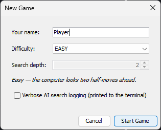
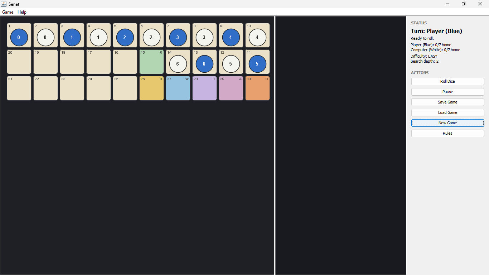
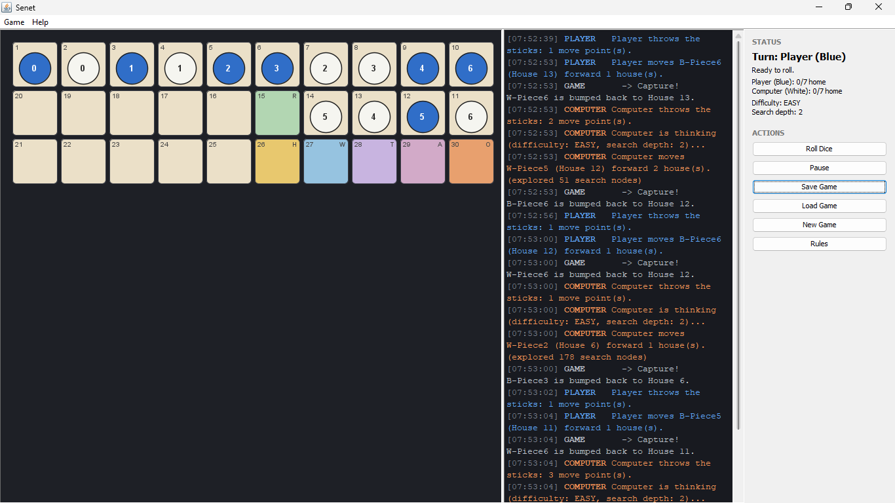
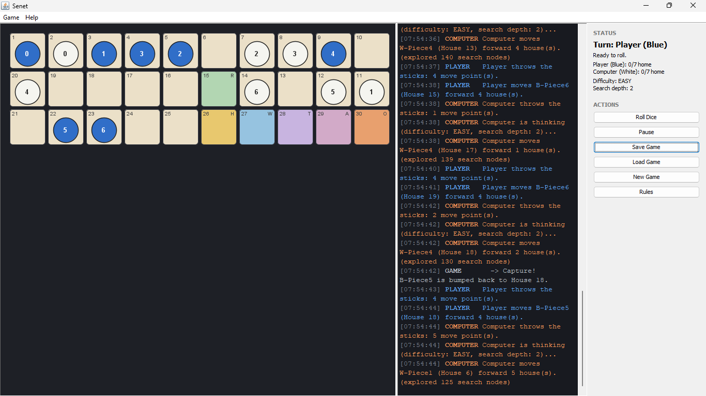
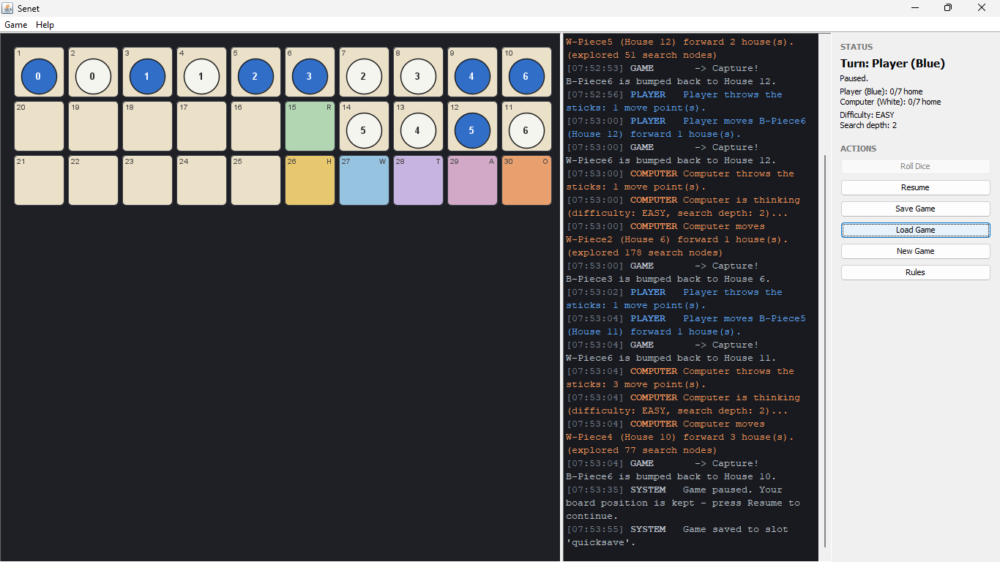
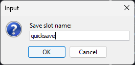
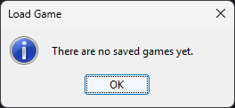
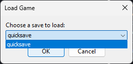
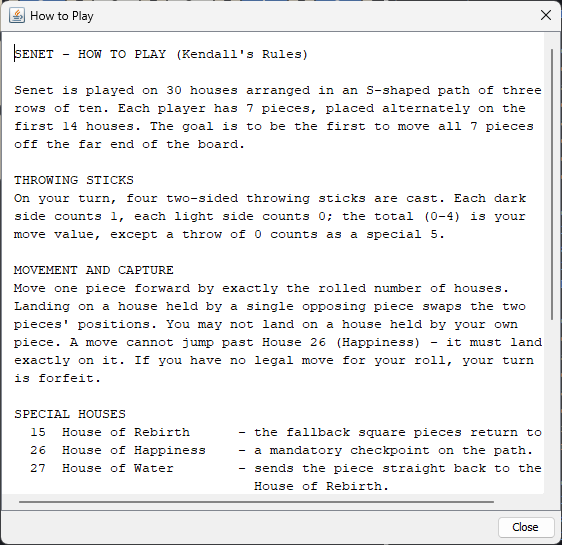

# دليل الواجهات

[⬅ الرئيسية](../README.ar.md) · [English](UI_GUIDE.md)

جولة على كل شاشة بالتطبيق، بنفس الترتيب يلي رح تواجهها فيه فعلياً: بدء لعبة، لعبها، إيقافها مؤقتاً، حفظها، تحميلها من جديد، ومراجعة القواعد. كل قسم بيسمّي الصنف (class) المسؤول عن هاي الشاشة — شوف [`ARCHITECTURE.ar.md`](ARCHITECTURE.ar.md) لتشوف كيف بينبسطوا مع بعض.

## بدء لعبة جديدة

**Game > New Game...**، أو زر **New Game**، أو تشغيل التطبيق لأول مرة — كلهم بيفتحوا نافذة الإعداد (`ui.NewGameDialog`):

- **Your name (اسمك)** — بيوسم قطعك بالكونسول وبلوحة الحالة؛ افتراضياً "Player" إذا تركته فاضي.
- **Difficulty (الصعوبة)** — وحدة من خمس مستويات جاهزة معرّفة بـ [`gameLogic.Difficulty`](../src/gameLogic/Difficulty.java) (سهل/متوسط/صعب/خبير/مخصص). اختيار مستوى جاهز بيعبّي عمق البحث الافتراضي تبعه تلقائياً وبيطلع وصف سطر واحد تحته، بالظبط متل الصورة (سهل: *"الكمبيوتر بيشوف نص-حركتين للأمام"*).
- **Search depth (عمق البحث)** — معطّل بالأربع مستويات الجاهزة، وقابل للتعديل بس لما تختار `CUSTOM`، من 1 لـ 8. شوف [`AI_DESIGN.ar.md`](AI_DESIGN.ar.md#عمق-البحث-والصعوبة) لتعرف شو بالضبط بيتحكم فيه العمق.
- **Verbose AI search logging (تسجيل تفصيلي لبحث الذكاء الاصطناعي)** — لما تفعّلها، كل عقدة MAX/MIN/CHANCE بيزورها البحث بتنطبع عالتيرمنال (مش عالكونسول جوا التطبيق — شوف [`AI_DESIGN.ar.md`](AI_DESIGN.ar.md#تسجيل-تشخيصي) ليش). خلّيها معطّلة للعب العادي؛ بتنتج كمية إخراج ضخمة كتير.

**Start Game** بيبني لوحة جديدة وبيبدأ اللعبة؛ **Cancel** بيسكّر النافذة بدون ما يبدأ شي (أو، إذا كان في لعبة شغالة أصلاً، بيخليها بالظبط متل ما كانت).

## النافذة الرئيسية

بمجرد ما تبدأ اللعبة، النافذة بتنقسم لثلاث مناطق زي ما رتّبها [`ui.MainFrame`](../src/ui/MainFrame.java):

- **اللوحة (يسار، `ui.BoardPanel`)** — الثلاثين خانة بمسارها الأصيل بشكل حرف S. لون تعبئة كل خانة بيدل على نوعها (شوف الجدول تحت)؛ الحرف الصغير بزاوية الخانة العلوية اليمنى هو رمز هاد النوع، مطابق لـ [`board.HouseType`](../src/board/HouseType.java). القطع دوائر معبّاة — أزرق للاعب الإنسان، أبيض/كريمي للكمبيوتر — مع رقم القطعة جواتها.
- **الكونسول (بالنص، `ui.ConsolePanel`)** — بيبدأ فاضي وبيتعبى تدريجياً مع تقدّم اللعبة (شوف القسم يلي بعده).
- **الحالة والإجراءات (يمين، `ui.ControlPanel`)** — دور مين، آخر رمية، عدد القطع "بالبيت" للاعبين الاثنين، الصعوبة وعمق البحث الحاليين، وستة أزرار إجراء: Roll Dice، Pause، Save Game، Load Game، New Game، Rules.

| لون الخانة | النوع | الرمز |
|---|---|---|
| كريمي | عادية | *(بدون)* |
| أخضر | بيت الميلاد الجديد (Rebirth) | `R` |
| ذهبي | بيت السعادة (Happiness) | `H` |
| أزرق | بيت الماء (Water) | `W` |
| بنفسجي | بيت الحقائق الثلاث (Three Truths) | `T` |
| وردي غامق | بيت رع-آتوم (Re-Atoum) | `A` |
| برتقالي | بيت حورس (Horus) | `O` |

شو بيصير للقطعة يلي بتوصل لكل وحدة منهم موجود بـ [`GAME_RULES.ar.md`](GAME_RULES.ar.md#الخانات-الخمس-الخاصة-بنهاية-اللعبة-26-30).

## لعب دور

اضغط **Roll Dice**؛ الكونسول بيعلن الرمية، وبينما القطع بتتحرك وتأسر وتفعّل تأثيرات الخانات الخاصة، كل حدث بينطبع بطابع زمني ولون حسب مين سببه: أزرق لـ `PLAYER`، برتقالي لـ `COMPUTER`، رمادي لسرد `GAME`/`SYSTEM` المحايد:

لاحظ سطور الكمبيوتر: *"Computer is thinking (difficulty: EASY, search depth: 2)..."* وبعدها *"(explored 51 search nodes)"* لما يتحرك — هاد العدد هو الحجم الفعلي لشجرة Expectiminimax يلي انفحصت لأجل هاد القرار الواحد، صغير بمستوى سهل وأكبر بكتير بالمستويات الأعلى. الأسر (النزول على قطعة خصم لحالها) دايماً بينسرد كسطر `GAME -> Capture!` مستقل بيسمّي أي قطعة انرجعت لورا ولأي خانة.

بس الحركات يلي صارت فعلياً هي يلي بتظهر هون — آلاف المواقف الافتراضية يلي الذكاء الاصطناعي بيقيّمها داخلياً وقت البحث ما بتنطبع أبداً بهالبانل؛ شوف [`ARCHITECTURE.ar.md`](ARCHITECTURE.ar.md#إصلاحات-مهمة-من-النموذج-الأولي-الأصلي) ليش هاد كان يتسرب للكونسول قبل إعادة كتابة هاد المشروع.

نقطة لاحقة من نفس نوع اللعبة بتبين هيك — أسر أكتر، قطع الاعبين الاثنين متقدمة أكتر عمسار الـ S، وأعداد العقد المفحوصة من الذكاء الاصطناعي بتتغيّر من حركة لحركة:

إذا ما عندك حركة قانونية للرمية يلي طلعتلك، الدور بينحسب تلقائياً والكونسول بيشرح ليش — ما بتحتاج تضغط أي شي لتمرير دورك.

## الإيقاف المؤقت والاستئناف

اضغط **Pause** بأي لحظة أثناء دورك عشان تجمّد الإدخال بدون ما تخسر موقعك؛ اللوحة والكونسول بيضلوا بالظبط متل ما كانوا، سطر الحالة بيصير **Paused**، والزر بيصير **Resume**:

اضغط **Resume** عشان تكمل بالظبط من وين وقفت. الإيقاف المؤقت لحاله ما بيكتب أي شي عالقرص — بس بيوقف الإدخال جوا آلة حالات الدور تبع `ui.GameController`؛ استخدم **Save Game** لحالها إذا بدك الموقع يضل موجود بعد ما تسكّر التطبيق.

## حفظ لعبة

اضغط **Save Game** (أو **Game > Save Game...**) بأي لحظة أثناء دورك عشان تكتب الموقع الحالي بخانة (slot) باسم تحدده:

الاسم يلي بتكتبه بيصير ملف `saves/<الاسم>.senetsave`، مكتوب من [`persistence.SaveManager`](../src/persistence/SaveManager.java). بيجمع اللوحة الكاملة، اللاعبين الاثنين، دور مين، وإعدادات الصعوبة/عمق البحث/التسجيل الفعّالة — كل شي لازم تكمل بالظبط من وين وقفت، حتى بجلسة لاحقة. شوف [`ARCHITECTURE.ar.md`](ARCHITECTURE.ar.md#ملفات-الحفظ) لصيغة الملف.

## تحميل لعبة

**Load Game** (زر أو **Game > Load Game...**) بيتصرف مختلف حسب إذا في أي حفظ موجود أصلاً. بدون أي حفظ:

مع خانة حفظ وحدة ع الأقل عالقرص، قائمة منسدلة بتسرد كل حفظ تحت `saves/` باسمه:

اختيار خانة والضغط عالـ **OK** بيرجّع اللوحة، اللاعبين الاثنين، دور مين، وإعدادات الصعوبة/عمق البحث بالظبط متل ما انحفظوا، واللعبة بتكمل من هناك.

## مرجع القواعد

**Help > How to Play...**، أو زر **Rules**، بيفتح القواعد الكاملة بنافذة قابلة للتمرير (`ui.RulesDialog`) بدون ما تطلع من اللعبة:

هاد نفس مرجع قواعد Kendall's Rules يلي بـ [`GAME_RULES.ar.md`](GAME_RULES.ar.md)، بس منسّق للقراءة جوا التطبيق — مفيد لمراجعة سريعة نص اللعبة بدون ما تطلع من النافذة.
